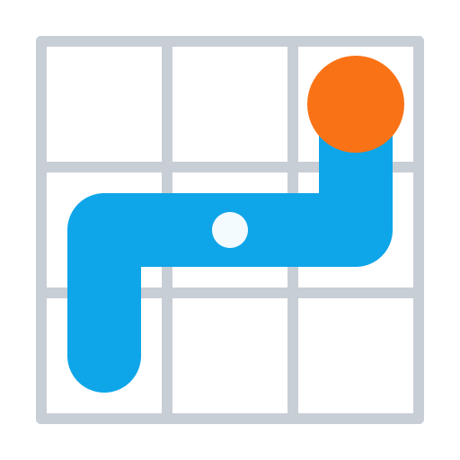

<br>
# Advanced Drunken Walkers
<i>Seeded drunkard's-walk generation engine. Carves organic maps with configurable walkers and scatters tagged marks - logic only, you draw the result.</i> <br>
### Version 1.2.0.0

[](https://github.com/SalmanShhh/C3Addon_Advanced-Drunken-walker/releases/download/salmanshh_advdrunkenwalkers-1.2.0.0.c3addon/salmanshh_advdrunkenwalkers-1.2.0.0.c3addon)
<br>
<sub> [See all releases](https://github.com/SalmanShhh/C3Addon_Advanced-Drunken-walker/releases) </sub> <br>

#### What's New in 1.2.0.0
- **Added:** - AsText expression: the grid as text, one character per cell, for instant visualisation in a Text object.
- **Added:** - Draw Cells To Tilemap action: sets a tile for every cell holding a value, replacing the paint loop.
- **Added:** - Add Walker From Preset action: registers a Cave, Corridors, River, Ore Vein, Lightning or Blob walker by name, using the Shape Recipes values.
- **Added:** - Set Walker Steps, Set Walker Turn Chance, Set Walker Brush Size and Set Walker Start Angle actions: every walker field is now reachable without a Define Walker JSON string.
- **Added:** - Debug Mode now also warns about the common mistakes behind an empty map: running with no walkers registered, running when every walker already finished, a tag that matches nothing, and a walker starting outside the grid.
- **Changed:** - Set walker steps sets the remaining budget and un-finishes a finished walker, so it can be topped up and run again.
- **Changed:** - Set walker start angle rotates the whole direction set; direction weights rotate with it.
- **Changed:** - Debug Mode property description now mentions the mistake warnings.

<sub>[View full changelog](#changelog)</sub>

---
<b><u>Author:</u></b> SalmanShh <br>
<sub>Made using [CAW](https://marketplace.visualstudio.com/items?itemName=skymen.caw) </sub><br>

## Table of Contents
- [Usage](#usage)
- [Examples Files](#examples-files)
- [Properties](#properties)
- [Actions](#actions)
- [Conditions](#conditions)
- [Expressions](#expressions)
---
## Usage
To build the addon, run the following commands:

```
npm i
npm run build
```

To run the dev server, run

```
npm i
npm run dev
```

## Examples Files

---
## Properties
| Property Name | Description | Type |
| --- | --- | --- |
| Grid Width | Grid width in cells. The grid is built at this size automatically when the layout starts - Create Grid is only needed for a different size. | integer |
| Grid Height | Grid height in cells. The grid is built at this size automatically when the layout starts - Create Grid is only needed for a different size. | integer |
| Max Grid Size | Hard cap on both axes. Create Grid clamps to this and warns in debug mode - a safety net against runaway expressions. | integer |
| Cell Size | Pixel size of one cell, used by the cell to layout coordinate expressions. | integer |
| Origin X | Layout X of the grid's top-left corner, for the coordinate expressions. | float |
| Origin Y | Layout Y of the grid's top-left corner, for the coordinate expressions. | float |
| Empty Value | The value the grid is filled with on creation and by Clear Grid. | integer |
| Seed | Initial seed. Leave empty to derive one from the current time (non-deterministic until Set Seed is called). | text |
| Random Source | Where random values come from: the built-in seeded PRNG, or the queue filled by Inject Random. | combo |
| Debug Mode | Log walker lifecycles, re-rolled boundary steps, clamped grid sizes, injected-queue underruns and warnings about common mistakes (running with no walkers, walkers starting outside the grid) to the browser console. | check |


---
## Actions
| Action | Description | Params
| --- | --- | --- |
| Clear grid | Fill every cell with the given value without touching walkers, marks or the random stream. Does not fire On Cell Carved. | Value             *(number)* <br> |
| Create grid | Only needed for a size other than the Grid Width and Grid Height properties - the grid those describe already exists when the layout starts. Allocates a fresh grid filled with the Empty Value, clamped to Max Grid Size. Pass a negative for either dimension to fall back to that property. Destroys any previous grid, walkers and marks. | Width             *(number)* <br>Height             *(number)* <br> |
| Draw cells to tilemap | Set one tile in the tilemap for every cell holding the value, without writing the loop yourself. Cells map straight onto tile coordinates, so cell (4, 2) sets tile (4, 2). Call it once per value to paint layered terrain, and pass tile -1 to erase instead. | Value             *(number)* <br>Tilemap             *(object)* <br>Tile             *(number)* <br> |
| Set cell | Write one cell directly, useful for pre-placing anchors before walkers run. Does not fire On Cell Carved. | X             *(number)* <br>Y             *(number)* <br>Value             *(number)* <br> |
| Set origin | Reposition the grid in layout space for the coordinate expressions. Pass 0 for the cell size to keep the current value. | X             *(number)* <br>Y             *(number)* <br>Cell Size             *(number)* <br> |
| Clear marks | Remove all marks with the tag. An empty string removes every mark. | Tag             *(string)* <br> |
| Drop marks along walk | Place tagged marks along a walker's recorded path: a candidate every N steps, kept with the given 0-1 chance, discarded when it lands within min spacing cells of a same-tag mark. Fires On Mark Placed per mark. | Walker ID             *(string)* <br>Tag             *(string)* <br>Every Steps             *(number)* <br>Chance             *(number)* <br>Min Spacing             *(number)* <br> |
| Scatter marks | Deterministically scatter up to count tagged marks onto cells holding the value. Interior requires all 8 neighbours to match (open areas), edge requires at least one that does not (against walls). Fires On Mark Placed per mark. | Tag             *(string)* <br>Count             *(number)* <br>Cell Value             *(number)* <br>Placement             *(combo)* <br>Min Spacing             *(number)* <br> |
| Dilate cells | Expand every region of the given value outward by one cell per iteration, widening corridors into chambers. Any cell with an 8-way neighbour holding the value is converted. Fires On Cell Carved for each newly converted cell. | Value             *(number)* <br>Iterations             *(number)* <br> |
| Outline cells | Write the outline value into every Empty Value cell adjacent 8-way to a cell holding the value - the classic put walls around the floor pass. Fires On Cell Carved for each written cell. | Value             *(number)* <br>Outline Value             *(number)* <br> |
| Inject random | Queue one 0-1 value for injected mode, for example AdvancedRandom.Random. A queue underrun during generation falls back to the internal PRNG and warns in debug mode. | Value             *(number)* <br> |
| Set random source | Switch where random values come from. In injected mode generation consumes the queue filled by Inject Random, which routes every decision through another plugin's stream. | Source             *(combo)* <br> |
| Set seed | Reset the internal PRNG with this seed. Call it before generation: the same seed with the same action order reproduces identical output. Pass AdvancedRandom.Seed here to share one master seed with the Advanced Random plugin. | Seed             *(string)* <br> |
| Add walker | Register a walker with the given core settings, including the value it carves. Remaining fields use the Walker Definition defaults. Walkers run in registration order. | ID             *(string)* <br>Start X             *(number)* <br>Start Y             *(number)* <br>Steps             *(number)* <br>Directions             *(number)* <br>Max Turn             *(number)* <br>Tag             *(string)* <br>Carve Value             *(number)* <br> |
| Add walker from preset | Register a walker from a named shape preset instead of raw numbers: Cave is the classic jittery carver, Corridors digs right-angled passages, River meanders in a wide ribbon, Ore Vein burrows downward, Lightning strikes down in a short jagged line, and Blob hollows out one round chamber. Presets only choose the movement settings - tune the result afterwards with the Set Walker actions, or use Add Walker for full control. | ID             *(string)* <br>Preset             *(combo)* <br>Start X             *(number)* <br>Start Y             *(number)* <br>Tag             *(string)* <br>Carve Value             *(number)* <br> |
| Define walker | Register a walker from a full Walker Definition JSON string, for example {"id":"cave","startX":32,"startY":32,"steps":400,"directions":8,"maxTurn":180,"startAngle":0,"turnChance":1,"carveValue":1,"brushSize":1,"tag":""}. Replaces any existing walker with the same id. | Definition             *(string)* <br> |
| Remove walker | Unregister the walker. Cells it already carved are unaffected. | ID             *(string)* <br> |
| Run all walkers | Execute every registered walker to the end of its step budget, in registration order, firing On Cell Carved per newly carved cell and On Walker Finished per walker, then On Generation Complete. |  |
| Run walker | Execute one walker to completion, firing its carve and finish triggers. Does not fire On Generation Complete. | ID             *(string)* <br> |
| Run walkers by tag | Execute every registered walker carrying the tag, in registration order, then fire On Walkers By Tag Complete. Lets you stage generation in passes. An empty tag runs only untagged walkers. | Tag             *(string)* <br> |
| Set walker brush size | Set the square brush a walker stamps each step: 1 carves a single cell, 3 a 3x3 block. The square brush never rotates; for a corridor that turns with the walker use Set Walker Dig Size instead, which overrides this while set. | ID             *(string)* <br>Brush Size             *(number)* <br> |
| Set walker carve value | Change the integer a walker writes into the cells it visits. It applies from the walker's next step, so cells it has already carved keep their old value. Set it before running the walker to pick that walker's terrain, or change it mid-run from On Walker Stepped to lay down two values along one path. | ID             *(string)* <br>Carve Value             *(number)* <br> |
| Set walker dig size | Make a walker dig out a rectangle that turns with it instead of a fixed square. Width is measured across the direction it faces, so it is the corridor width, and is always centred. Depth is measured along that direction and is signed: a positive digs forward from the walker's own cell, a negative digs behind it, and either way its own cell is included, so 1 and -1 both mean just that cell. A walker facing right digs a corridor width cells tall, and the same walker facing down digs one width cells wide. Pass 0 for a dimension to fall back to the walker's brush size for that axis, and 0 for both to restore the plain square brush. | ID             *(string)* <br>Width             *(number)* <br>Depth             *(number)* <br> |
| Set walker direction weights | Bias which way a walker turns. Weights are relative, comma separated, one per direction in direction order: entry 0 is the walker's start angle and the rest follow it clockwise. A weight of 0 rules a direction out, and any entry you leave off counts as 1. Missing directions still apply, so "3,1,1" on an 8 direction walker weights the first three and leaves the other five at 1. Leave the string empty to go back to equal weights. | ID             *(string)* <br>Weights             *(string)* <br> |
| Set walker start angle | Set the angle a walker's direction set is anchored at, in degrees: 0 is right and 90 is down, matching Construct's angle system. The walker's evenly spaced headings rotate with it, and so do its direction weights, since weight entry 0 always weighs the start angle. A walker that has not started faces the new start angle; one mid-walk snaps to the nearest of its new headings. | ID             *(string)* <br>Start Angle             *(number)* <br> |
| Set walker steps | Set a walker's step budget. The value becomes its remaining steps, and a finished walker given steps is un-finished, so you can top a walker up and run it again to extend its path. | ID             *(string)* <br>Steps             *(number)* <br> |
| Set walker turn chance | Set the probability per step, 0 to 1, that a walker considers turning at all. Low values give long straight runs between turns; 1 lets it reconsider its heading every step. | ID             *(string)* <br>Turn Chance             *(number)* <br> |
| Step walker | Advance one walker by up to N steps, the animated-generation path. Fires On Walker Stepped per step and On Walker Finished when the budget is exhausted. | ID             *(string)* <br>Steps             *(number)* <br> |


---
## Conditions
| Condition | Description | Params
| --- | --- | --- |
| Is cell value | True if the cell holds exactly the given value. Out-of-bounds cells match nothing. | X *(number)* <br>Y *(number)* <br>Value *(number)* <br> |
| Is inside grid | True if the coordinates fall within the current grid. | X *(number)* <br>Y *(number)* <br> |
| Has mark at | True if a mark with the tag sits on that cell. An empty tag matches any mark. | X *(number)* <br>Y *(number)* <br>Tag *(string)* <br> |
| On mark placed | Fires once per mark from Drop Marks Along Walk and Scatter Marks. Use MarkX, MarkY and MarkTag inside. An empty filter matches all tags. | Tag *(string)* <br> |
| Has walker | True if a walker with the id is currently registered. | ID *(string)* <br> |
| On cell carved | Fires once per cell whose value changes during walker runs, dilation or outlining. Use CarvedX, CarvedY, CarvedValue and WalkerID inside. On big grids prefer iterating results after generation over per-cell spawning here. |  |
| On generation complete | Fires after Run All Walkers finishes every walker. The idiomatic place to run mark passes and paint your tilemap via the Count and Index expressions. |  |
| On walker finished | Fires when a walker exhausts its step budget or runs out of legal moves. WalkerX and WalkerY give its final cell, useful for chaining the next walker onto this one's endpoint. An empty filter matches all walkers. | ID *(string)* <br> |
| On walkers by tag complete | Fires after a Run Walkers By Tag call finishes its whole batch. The batch tag is readable via WalkerTag inside. An empty filter matches any batch. | Tag *(string)* <br> |
| On walker stepped | Fires after each step of Step Walker only, batch runs skip it for speed. WalkerX, WalkerY, WalkerAngle and WalkerStepsLeft are valid inside. An empty filter matches all walkers. | ID *(string)* <br> |


---
## Expressions
| Expression | Description | Return Type | Params
| --- | --- | --- | --- |
| AsText | The grid as text, one character per cell and one line per row. Character N of Characters stands for value N, so ".#" shows empty cells as dots and value 1 as #; values with no character show as ?. Set a Text object to this to see the whole map at a glance. | string | Characters *(string)* <br> | 
| CellToLayoutX | Layout X of the cell's centre, from Origin X and Cell Size. | number | X *(number)* <br> | 
| CellToLayoutY | Layout Y of the cell's centre, from Origin Y and Cell Size. | number | Y *(number)* <br> | 
| CellValue | Value at the cell. Returns the Empty Value for out-of-bounds queries. | number | X *(number)* <br>Y *(number)* <br> | 
| CountCells | Total cells currently holding the value. Pairs with GetCellXByIndex and GetCellYByIndex to iterate results. | number | Value *(number)* <br> | 
| GetCellXByIndex | X of the index-th cell holding the value, 0-based in a stable left-to-right, top-to-bottom order. Returns -1 when out of range. | number | Value *(number)* <br>Index *(number)* <br> | 
| GetCellYByIndex | Y of the index-th cell holding the value, 0-based in a stable left-to-right, top-to-bottom order. Returns -1 when out of range. | number | Value *(number)* <br>Index *(number)* <br> | 
| GridHeight | Current grid height in cells. | number |  | 
| GridWidth | Current grid width in cells. | number |  | 
| LayoutToX | Cell X containing the layout X coordinate. May fall outside the grid. | number | X *(number)* <br> | 
| LayoutToY | Cell Y containing the layout Y coordinate. May fall outside the grid. | number | Y *(number)* <br> | 
| NeighbourCount | How many of the 8 neighbours hold the given value, handy for autotiling and custom placement rules. Off-grid neighbours never match. | number | X *(number)* <br>Y *(number)* <br>Value *(number)* <br> | 
| CountMarks | Marks with the tag. An empty tag counts every mark. Pairs with GetMarkXByIndex and GetMarkYByIndex to iterate results. | number | Tag *(string)* <br> | 
| GetMarkXByIndex | X of the index-th mark with the tag, 0-based in placement order. Returns -1 when out of range. | number | Tag *(string)* <br>Index *(number)* <br> | 
| GetMarkYByIndex | Y of the index-th mark with the tag, 0-based in placement order. Returns -1 when out of range. | number | Tag *(string)* <br>Index *(number)* <br> | 
| MarkTag | Tag of the mark just placed, inside On Mark Placed. | string |  | 
| MarkX | X of the mark just placed, inside On Mark Placed. | number |  | 
| MarkY | Y of the mark just placed, inside On Mark Placed. | number |  | 
| CurrentSeed | The seed the PRNG was last set with. | string |  | 
| CarvedValue | Value just written into the cell, inside On Cell Carved. | number |  | 
| CarvedX | X of the cell just written, inside On Cell Carved. | number |  | 
| CarvedY | Y of the cell just written, inside On Cell Carved. | number |  | 
| WalkerAngle | Current heading of the triggering walker in degrees, 0 = right and 90 = down. Reads 0 outside walker triggers. | number |  | 
| WalkerID | ID of the triggering walker, inside walker triggers and On Cell Carved. Empty for post-processing passes and outside triggers. | string |  | 
| WalkerStepsLeft | Remaining step budget of the triggering walker. Reads 0 outside walker triggers. | number |  | 
| WalkerTag | Tag of the triggering walker, inside walker triggers and On Cell Carved, or the batch tag inside On Walkers By Tag Complete. | string |  | 
| WalkerX | Current X of the triggering walker. Reads 0 outside walker triggers. | number |  | 
| WalkerY | Current Y of the triggering walker. Reads 0 outside walker triggers. | number |  | 


---
## Changelog

**2.0.0.0**
- **Added:** Create Grid now takes a negative width or height to mean "use the Grid Width / Grid Height property". The property-sized grid is still built automatically when the layout starts, so Create Grid is only needed for a different size. Add Walker now takes a Carve Value, so a walker can write any integer without dropping to a Define Walker JSON string, and the new Set Walker Carve Value action changes it on an existing walker - from On Walker Stepped it lets one walker lay down two materials along a single path.
- **Changed:** BREAKING: column/row wording is gone from the whole API. Grid size expressions are now GridWidth and GridHeight; every cell coordinate is X/Y - GetCellXByIndex, GetCellYByIndex, LayoutToX, LayoutToY, MarkX, MarkY, GetMarkXByIndex, GetMarkYByIndex, CarvedX, CarvedY, WalkerX, WalkerY. Action and condition parameters are renamed to X and Y (Add Walker takes Start X and Start Y), the Walker Definition JSON uses startX and startY, and savegames written by 1.0.0.0 no longer load.
- **Fixed:** Create Grid no longer treats a width or height of 0 as a silent request for the property default; it warns and falls back instead of leaving an unusable grid.

**1.2.0.0**
- **Added:** - AsText expression: the grid as text, one character per cell, for instant visualisation in a Text object.
- **Added:** - Draw Cells To Tilemap action: sets a tile for every cell holding a value, replacing the paint loop.
- **Added:** - Add Walker From Preset action: registers a Cave, Corridors, River, Ore Vein, Lightning or Blob walker by name, using the Shape Recipes values.
- **Added:** - Set Walker Steps, Set Walker Turn Chance, Set Walker Brush Size and Set Walker Start Angle actions: every walker field is now reachable without a Define Walker JSON string.
- **Added:** - Debug Mode now also warns about the common mistakes behind an empty map: running with no walkers registered, running when every walker already finished, a tag that matches nothing, and a walker starting outside the grid.
- **Changed:** - Set walker steps sets the remaining budget and un-finishes a finished walker, so it can be topped up and run again.
- **Changed:** - Set walker start angle rotates the whole direction set; direction weights rotate with it.
- **Changed:** - Debug Mode property description now mentions the mistake warnings.

**1.1.0.0**
- **Added:** - Carve Value parameter on Add Walker (default 1), so a walker can write any integer without a Define Walker JSON string.
- **Added:** - New action Set walker carve value (ID, Carve Value), which applies from the walker's next step so already carved cells keep their old value.
- **Added:** - Create Grid accepts a negative width or height to mean "use the Grid Width / Grid Height property".
- **Added:** - AsText expression: the grid as text, one character per cell, for instant visualisation in a Text object.
- **Added:** - Draw Cells To Tilemap action: sets a tile for every cell holding a value, replacing the paint loop.
- **Added:** - Add Walker From Preset action: registers a Cave, Corridors, River, Ore Vein, Lightning or Blob walker by name, using the Shape Recipes values.
- **Added:** - Set Walker Steps, Set Walker Turn Chance, Set Walker Brush Size and Set Walker Start Angle actions: every walker field is now reachable without a Define Walker JSON string.
- **Added:** - Debug Mode now also warns about the common mistakes behind an empty map: running with no walkers registered, running when every walker already finished, a tag that matches nothing, and a walker starting outside the grid.
- **Changed:** - Grid size expressions: GridCols / GridRows are now GridWidth / GridHeight.
- **Changed:** - Cell coordinates are X/Y everywhere: GetCellXByIndex, GetCellYByIndex, LayoutToX, LayoutToY, MarkX, MarkY, GetMarkXByIndex, GetMarkYByIndex, CarvedX, CarvedY, WalkerX, WalkerY.
- **Changed:** - Action and condition params renamed to X and Y; Add Walker takes Start X and Start Y.
- **Changed:** - Walker Definition JSON uses startX and startY.
- **Changed:** - Docs now state that the property sized grid is built automatically at startup, so Create Grid is only needed for a different size.
- **Fixed:** - Create Grid no longer treats 0 as a silent request for the property default. It warns in debug mode and falls back, instead of leaving an unusable empty grid.

**1.0.0.0**
- **Added:** initial release

**0.0.0.0**
- **Added:** Initial release.
